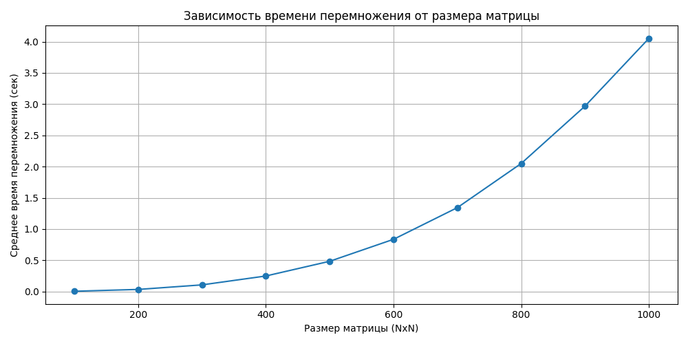

# Лабораторная работа №1  
## Тема: Умножение матриц и автоматизированная верификация результатов

---

### 🎯 Цель работы

Разработка программы на языке C++ для перемножения квадратных матриц различных размеров с автоматизированной верификацией результатов при помощи Python (NumPy), а также — исследование зависимости времени выполнения от размера задачи.

---

### ⚙️ Ход выполнения работы

1. Реализована программа на C++, которая:
   - генерирует по 10 пар случайных матриц для каждого размера (от 100×100 до 1000×1000),
   - перемножает их и сохраняет результат в структуре `matrices/NxN/set_K/`,
   - измеряет **среднее время выполнения** и сохраняет его в `timings.txt`.
2. Разработан скрипт на Python, который:
   - проходит по всем сгенерированным матрицам,
   - перемножает их через NumPy,
   - сверяет с результатом из C++,
   - выводит лог проверки в `results.txt`,
   - строит график по данным из `timings.txt`.

---

### 📁 Структура проекта

```
matrix_lab/
├── main.cpp
├── matrix_utils.cpp
├── matrix_utils.hpp
├── CMakeLists.txt
├── timings.txt
├── results.txt
├── timing_plot_from_file.png
├── verify.py
├── matrices/
│   ├── 100x100/
│   │   ├── set_1/
│   │   │   ├── A.txt
│   │   │   ├── B.txt
│   │   │   └── C.txt
│   │   └── ...
│   └── ...
```

---

### ✅ Результаты экспериментов

#### Верификация:
Все наборы матриц прошли автоматическую проверку. Результаты записаны в `results.txt`.

#### Среднее время выполнения (`timings.txt`):

```
Размер    Среднее время (сек)
100       0.0041
200       0.0317
300       0.1058
400       0.2488
500       0.4909
600       0.8437
700       1.3361
800       2.0636
900       2.9702
1000      4.0808
```

#### 📊 График зависимости:


---

### 🧠 Выводы

- Время выполнения алгоритма растёт **нелинейно** с увеличением размера матрицы, что подтверждает его кубическую сложность **O(n³)**.
- Быстрый рост наблюдается особенно при размерах от 600×600 и выше.
- Python-верификация подтвердила корректность вычислений.
- Итоговый график и численные данные дают возможность проанализировать эффективность и заложить основу для оптимизации с использованием OpenMP/CUDA.

---
